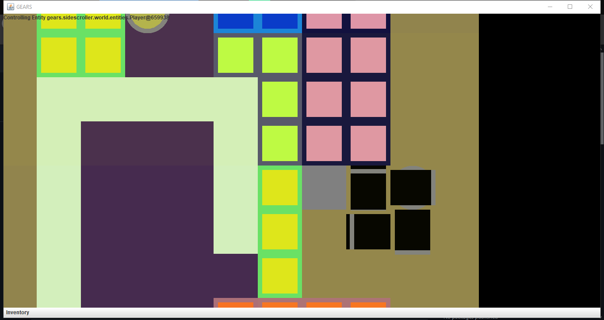
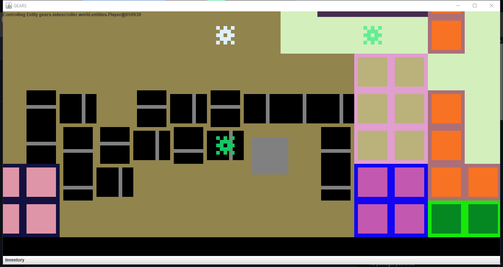
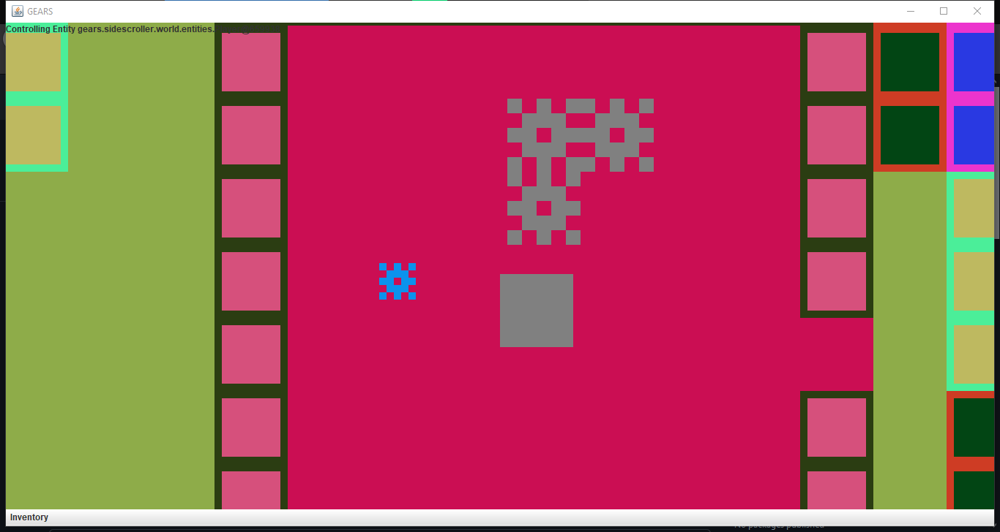

# GEARS

Currently just a toolkit for allowing me to create games.

## Summary

I enjoy creating game projects to maintain my skills whenever college or work
don't fully satisfy my programming "itch".
Seeing as I have my Associate of Science in Java, I find it helpful to practice 
this language, as I have done to a great extent in 
[Orpheus](https://github.com/Matt-Crow/Orpheus).
Unfortunately, Orpheus has gotten rather large and difficult to work with, so I 
wanted to practice Java using something a bit simpler (preferably without socket 
programming...).
GEARS is mostly a collection of game mechanics I've had for some time. I made an 
early version of this game several years ago in my 
[other GEARS repository](https://github.com/Matt-Crow/GEARS), though these 
versions have diverged significantly in their designs and general ideas. 

## How to Run the Program

Currently, this project contains 2 sub-projects: GearsSidescroller and 
ImageEditor. ImageEditor isn't complete, so you'll want to head on over to 
GearsSidescroller, which contains a JAR file under 
Gears/GearsSidescroller/build/libs. Simply double-click the JAR file to run it, 
or run from the command line:

```
java -jar GearsSidescroller/build/libs/GearsSidescroller-0.9.jar
```

when run from the repository root.

## Matt's To Do List

* everything in the package info for world
* sprite loader
* Renderable interface which gives access to a 1x1 tile sprite
* not sure if JSON serialization is needed, or levels should just be created in
  memory. If it is needed, I'll want to rewrite it so it's harder to forget to
  implement a deserializer for each new serializable class. A unit test could
  work. 

## Controls

* WASD to move
* Q to interact with your current tile (such as picking up placed gears)
* L to toggle your light
* hold X to sneak
* C to open command console
* +/= to zoom in
* -/_ to zoom out
* select items from the "inventory" menu on the bottom of the screen to use them

## Some Screenshots

Here are just a few examples of the kind of worlds this program can generate:



